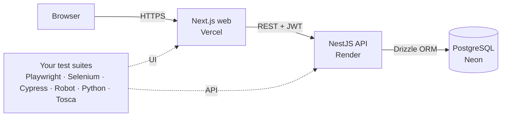

# TaskFlow Pro

**Enterprise project & task management platform, built as a realistic *system under test* for learning test automation across multiple tech stacks.**

[](https://github.com/<your-username>/taskflow-pro/actions/workflows/ci.yml)

| | Link |
|---|---|
| 🌐 Live app | `https://<your-app>.vercel.app` |
| 📘 API docs (Swagger) | `https://taskflow-pro-api-fb40.onrender.com/api/docs` |
| 📊 Test report (once you build the CI stories) | `https://<your-username>.github.io/taskflow-pro/` |

> Demo accounts (password `Password@123`): `admin@taskflow.dev`, `manager@taskflow.dev`, `member@taskflow.dev`, or click **Continue as guest** for read-only access with no sign-up.

---

## Features

| Area | What it does |
|---|---|
| **Auth** | Register, login (JWT), profile update, change password, strong-password policy, session expiry handling |
| **Role-based access** | `ADMIN` / `MANAGER` / `MEMBER` / read-only `GUEST` enforced on every API route and reflected in the UI |
| **Guest mode** | One-click "Continue as guest": visitors browse every project and task but can't change anything |
| **Projects** | Create (unique key like `CRM`), search, filter, archive/restore, delete with cascade, member management |
| **Tasks** | Auto-numbered keys (`CRM-12`), priority, status, assignee, due date, labels, description |
| **Kanban board** | Drag-and-drop between columns with optimistic updates and rollback on error |
| **Business rules** | Tasks need an assignee before `IN_REVIEW`/`DONE`; assignees must be project members; archived projects are read-only |
| **Search & filters** | Full-text search, filter by project/status/priority/assignee/label/overdue, sorting, pagination, URL-synced state |
| **Comments** | Threaded discussion on tasks; authors and admins can delete |
| **Dashboard** | KPIs, status & priority charts, “my open tasks”, recent activity |
| **Admin** | User management (roles, activate/deactivate), full audit log |
| **Platform** | Swagger/OpenAPI docs, consistent error format, validation, rate limiting, Helmet security headers, health check |

## Tech stack (2026 market standard)

| Layer | Technology |
|---|---|
| Frontend | **Next.js 16** (App Router), **React 19**, **TypeScript 6**, **Tailwind CSS 4**, TanStack Query 5, Sonner, Lucide |
| Backend | **NestJS 12** (native ESM), class-validator, JWT, `@nestjs/throttler`, Helmet, Swagger/OpenAPI |
| Database | **PostgreSQL 17** + **Drizzle ORM** (type-safe SQL, versioned migrations) |
| Unit tests | Vitest |
| CI/CD | **GitHub Actions** (build + unit tests); test pipelines are part of the automation backlog |
| Hosting | Vercel (web), Render (API), Neon (Postgres) – all free tiers |
| Tooling | pnpm workspaces (monorepo), Docker & Docker Compose |

## Architecture



## Repository layout

```
taskflow-pro/
├── apps/
│   ├── api/                 NestJS REST API
│   │   ├── src/             auth, users, projects, tasks, comments, dashboard, activity, health
│   │   ├── src/database/    Drizzle schema, migrator, seed
│   │   └── drizzle/         SQL migrations
│   └── web/                 Next.js frontend (App Router)
├── tests/                   ← YOUR automation code goes here, one folder per stack
├── qa/                      ← your test plan, test cases, bug reports
├── tracker/                 automation backlog board (open the .html in a browser)
├── .github/workflows/       ci.yml (build + unit tests)
├── docs/                    ARCHITECTURE · TESTING-GUIDE · DEPLOYMENT · ROADMAP
├── docker-compose.yml
└── render.yaml              Render blueprint for the API
```

## Run it locally

**Prerequisites:** Node.js 22+, pnpm 10 (`corepack enable`), Docker Desktop (or a local PostgreSQL).

```bash
git clone https://github.com/<your-username>/taskflow-pro.git
cd taskflow-pro
pnpm install

# 1. database
docker compose up -d db

# 2. env files
cp apps/api/.env.example apps/api/.env
cp apps/web/.env.example apps/web/.env.local

# 3. schema + demo data
pnpm db:migrate
pnpm db:seed

# 4. start API (http://localhost:4000) and web (http://localhost:3000)
pnpm dev
```

Swagger UI: http://localhost:4000/api/docs

> **Windows tip:** run the commands in PowerShell or Git Bash. If `pnpm` is not found, run `corepack enable` from an admin terminal first.

Or run the whole stack in containers: `docker compose up --build`.

## Automation practice

There are **no automated tests in this repo yet**. Building them is the exercise.

1. Read **[docs/TESTING-GUIDE.md](docs/TESTING-GUIDE.md)**: the requirements spec, roles matrix, business rules, API list, locators and the story workflow.
2. Open **[tracker/taskflow-tracker.html](tracker/taskflow-tracker.html)** in Chrome or Edge (double-click it). It's a Jira-style board: drag tickets between statuses and sprints, and click one to see its acceptance criteria. Start with Sprint 1.
3. Write the tests for a story in `tests/<stack>/`, set the story to *In Review*, then ask Claude to review it.

Reset the database to a clean, seeded state at any time with `pnpm db:reset`.

Unit tests for the API: `pnpm test:unit`.

## Documentation

- [docs/ARCHITECTURE.md](docs/ARCHITECTURE.md) – how the app works: request flow, auth, data model, user journeys, tech stack
- [docs/TESTING-GUIDE.md](docs/TESTING-GUIDE.md) – requirements, business rules, environments, story workflow
- [tracker/taskflow-tracker.html](tracker/taskflow-tracker.html) – automation backlog (75 stories), works offline in your browser
- [docs/DEPLOYMENT.md](docs/DEPLOYMENT.md) – deploy to Neon + Render + Vercel, step by step
- [docs/ROADMAP.md](docs/ROADMAP.md) – app versions and the AI phase
