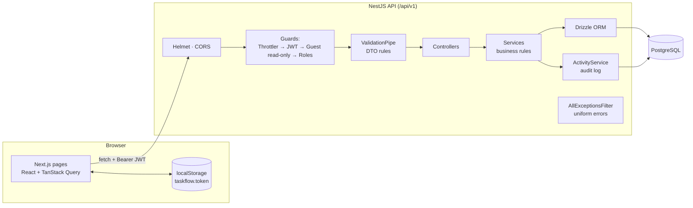
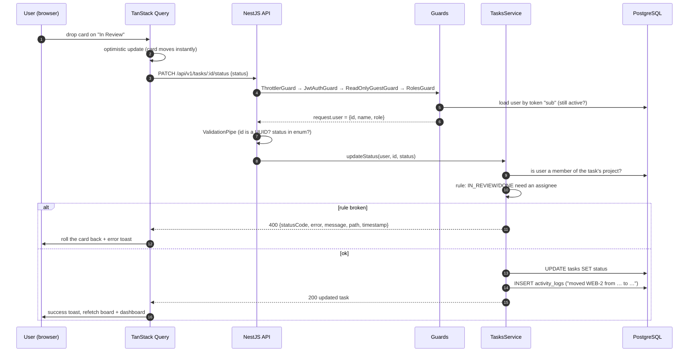
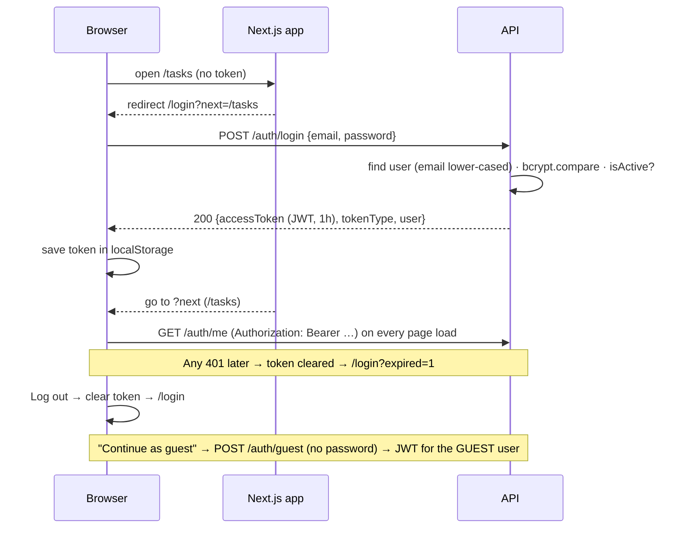
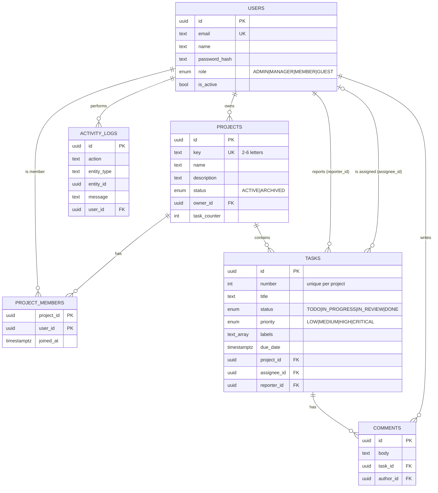
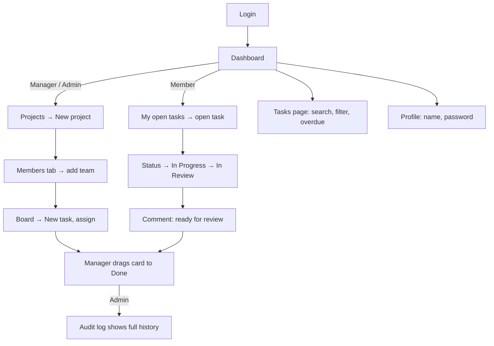
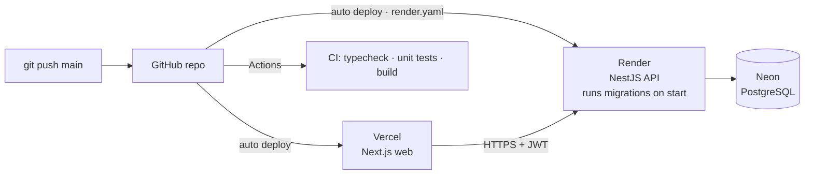

# Architecture & how TaskFlow Pro works

This document explains **what the app does, how it is built, and how a request flows through it**. Read it before writing tests: knowing the internals tells you where bugs hide and what to assert.

> Diagrams use Mermaid. They render automatically on GitHub and in VS Code with the "Markdown Preview Mermaid Support" extension.

---

## 1. What it is

TaskFlow Pro is a project and task management web app (a small Jira). Teams create projects, add members, plan work as tasks on a Kanban board, discuss in comments and track progress on a dashboard. Admins manage users and can see an audit log of every change.

| Module | What users can do |
|---|---|
| **Authentication** | Register, log in, see and edit profile, change password, log out |
| **Roles (RBAC)** | ADMIN, MANAGER, MEMBER and a read-only GUEST see and can do different things (see TESTING-GUIDE §2) |
| **Guest access** | "Continue as guest" on the login page: browse everything, change nothing |
| **Projects** | Create with a unique key (e.g. `CRM`), search, filter by status, rename, archive/restore, delete, manage members |
| **Kanban board** | Four columns (To Do, In Progress, In Review, Done); drag cards or use the "Move to" dropdown |
| **Tasks** | Auto keys (`CRM-12`), title, description, priority, assignee, due date, labels; edit, delete |
| **Tasks list** | Search, filter by project/status/priority/mine/overdue, sort, paginate; filters live in the URL |
| **Comments** | Discuss a task; authors and admins can delete |
| **Dashboard** | KPI cards, tasks by status and by priority, "my open tasks", recent activity |
| **Admin: Users** | Search, filter by role, change role, activate/deactivate |
| **Admin: Audit log** | Every create/update/delete with who and when |
| **Platform** | Swagger docs, health check, validation, rate limiting, security headers, consistent error format |

---

## 2. Tech stack and why each piece was chosen

| Layer | Technology | Why |
|---|---|---|
| Frontend framework | **Next.js 16** (App Router) + **React 19** | Most-hired React framework; file-based routing; deploys free on Vercel |
| Language | **TypeScript 6** everywhere | One language across web and API; types catch bugs early |
| Styling | **Tailwind CSS 4** | Utility classes; no separate CSS files to maintain |
| Server state | **TanStack Query 5** | Caching, refetching, optimistic updates (the Kanban board uses one) |
| UI bits | Sonner (toasts), Lucide (icons) | Small, popular libraries |
| Backend framework | **NestJS 12** (native ES modules) | Enterprise-style structure (modules, controllers, services, guards), similar to Spring Boot |
| Validation | class-validator + class-transformer | Declarative rules on DTO classes; invalid input → 400 automatically |
| Auth | JWT (`@nestjs/jwt`) + bcrypt password hashing | Stateless tokens; industry standard |
| Security | Helmet, CORS allow-list, `@nestjs/throttler` rate limiting | Safe defaults for a public API |
| API docs | Swagger / OpenAPI (`@nestjs/swagger`) | Try every endpoint in the browser; import into Postman/Tosca |
| Database | **PostgreSQL 17** | The most popular open-source relational DB |
| ORM | **Drizzle ORM** + drizzle-kit migrations | Type-safe SQL with no binary engine; versioned SQL migrations |
| Unit tests | Vitest | Fast, Jest-compatible |
| Monorepo | pnpm workspaces | One install for web + API, shared lockfile |
| Containers | Docker + Docker Compose | Same environment everywhere |
| CI | GitHub Actions | Build and unit tests on every push |
| Hosting | Vercel (web) · Render (API) · Neon (Postgres) | All have free tiers |

---

## 3. System architecture



The web app and API are **separate deployables**. The browser talks to the API directly over HTTPS (CORS allows only the web origin). There is no server-side session: the JWT in `localStorage` is the session.

---

## 4. Life of a request

Example: a member moves task `WEB-2` to *In Review* on the board.



**Key points for testers**
- **Guards run before validation** (NestJS order: guards → pipes → handler). A request with no token gets 401 even if its body is invalid. After authentication, unknown fields and wrong types return 400 before any business logic runs.
- **The user is re-read from the DB on every request.** Deactivating a user or changing their role takes effect immediately, even with an old token.
- **Order of checks**: 429 rate limit → 401 token → 403 guest write (`ReadOnlyGuestGuard`) → 403 role (`@Roles`) → 400 validation → 404 not found → 403 not a project member → 400 business rule.
- **Guests are read-only by design, not by checklist.** One global guard rejects every non-GET request from a GUEST, so a new endpoint can't accidentally let guests write.
- Every change writes an **audit log** row, which is useful for asserting side effects.

---

## 5. Authentication flow



- JWT payload: `{ sub: userId, role }`, signed with `JWT_SECRET`, lifetime `JWT_EXPIRES_IN` (1h).
- Passwords are hashed with bcrypt (cost 10) and never returned by any endpoint.
- Login has a stricter rate limit (60/min) than the rest of the API (300/min).

---

## 6. Data model



- **Cascade deletes**: deleting a project removes its members, tasks and their comments. Deleting a user's membership sets their open tasks' assignee to null (done in code).
- **Task keys**: `projects.task_counter` is incremented inside a transaction, so `KEY-n` numbers are sequential and never reused within a project.
- Migrations live in `apps/api/drizzle/*.sql`. The schema source is `apps/api/src/database/schema.ts`.

---

## 7. User journeys



| Role | Typical day |
|---|---|
| **Admin** | Onboards users (role changes), deactivates leavers, checks the audit log, can do everything a manager can in every project |
| **Manager** | Creates projects, builds the team, plans tasks, reviews and closes work on the board |
| **Member** | Works their assigned tasks, moves them across the board, comments; can create tasks in projects they belong to |
| **Guest** | A visitor (e.g. a recruiter on your live link) browsing every project, board and task without signing up; can't change anything |

---

## 8. Frontend structure

```
apps/web/src/
├── app/
│   ├── (auth)/login, (auth)/register   public pages (centered card layout)
│   ├── (app)/layout.tsx                 AppShell: sidebar + header; redirects to /login if no user
│   ├── (app)/dashboard                  KPIs, charts, my tasks, activity
│   ├── (app)/projects                   project cards, search, create modal
│   ├── (app)/projects/[id]              tabs: Board · List · Members · Settings
│   ├── (app)/tasks                      filterable task table (filters in URL)
│   ├── (app)/tasks/[id]                 task detail, status, comments
│   ├── (app)/admin/users, admin/activity
│   └── (app)/profile
├── components/   AppShell, TaskFormModal, TaskTable, ui (badges, modal, pagination…)
└── lib/          api.ts (fetch wrapper), auth.tsx (AuthProvider), types.ts, format.ts
```

- **`lib/api.ts`** adds the bearer token, turns error JSON into `ApiError`, and on any 401 clears the token and redirects to `/login?expired=1`.
- **`lib/auth.tsx`** loads `/auth/me` on start, and exposes `login`, `register`, `logout` and the current user.
- **TanStack Query** caches each screen's data (key per screen). Mutations invalidate related keys so the dashboard, board and lists stay in sync. Retries once, data fresh for 10 s.
- Every interactive element has a **`data-testid`** for automation.

## 9. Backend structure

```
apps/api/src/
├── main.ts                 bootstrap: helmet, CORS, /api/v1 prefix, ValidationPipe, Swagger, keep-alive
├── app.module.ts           wires modules + global guards (Throttler → JwtAuth → ReadOnlyGuest → Roles)
├── common/                 @Public/@Roles/@CurrentUser decorators, guards (JWT, roles, read-only guest), error filter, pagination
├── database/               schema.ts, database.module.ts, migrate.ts, seed.ts, seed-data.ts, reset.ts
├── auth/                   register, login, me, change password
├── users/                  list, role, status (admin)
├── projects/               CRUD, membership, access checks (getAccessible / canManage)
├── tasks/                  CRUD, status, filters, business rules
├── comments/               add / list / delete
├── dashboard/              aggregated stats
├── activity/               audit log writer + admin list
└── health/                 liveness + DB check
```

Each feature follows **Controller → Service → Drizzle**. Controllers handle HTTP and validation (DTOs). Services hold every business rule and permission check.

---

## 10. Configuration

| Variable | Where | Default | Purpose |
|---|---|---|---|
| `DATABASE_URL` | API | local Postgres | Connection string |
| `DATABASE_SSL` | API | `false` | `true` for Neon / cloud Postgres |
| `JWT_SECRET` | API | dev value | Token signing key (**must** be changed in prod) |
| `JWT_EXPIRES_IN` | API | `1h` | Token lifetime |
| `CORS_ORIGIN` | API | `http://localhost:3000` | Comma-separated allowed web origins |
| `THROTTLE_LIMIT` / `LOGIN_THROTTLE_LIMIT` | API | 300 / 60 per min | Rate limits |
| `GUEST_LOGIN_ENABLED` | API | `true` | `false` turns off "Continue as guest" |
| `PORT` | API | 4000 | HTTP port |
| `NEXT_PUBLIC_API_URL` | Web (build time) | `http://localhost:4000/api/v1` | Where the browser calls the API |

## 11. Useful commands

| Command | What it does |
|---|---|
| `pnpm dev` | API (watch mode) + web (dev server) |
| `pnpm db:migrate` / `pnpm db:seed` | Apply migrations / add demo data (idempotent) |
| `pnpm db:reset` | Wipe + migrate + seed (local DB only unless `--yes`) |
| `pnpm db:generate` | Create a new SQL migration after editing `schema.ts` |
| `pnpm build` | Production build of API and web |
| `pnpm typecheck` / `pnpm test:unit` | Type errors / API unit tests |
| `docker compose up --build` | Whole stack in containers |

## 12. Deployment architecture



Step-by-step instructions: [DEPLOYMENT.md](DEPLOYMENT.md).
